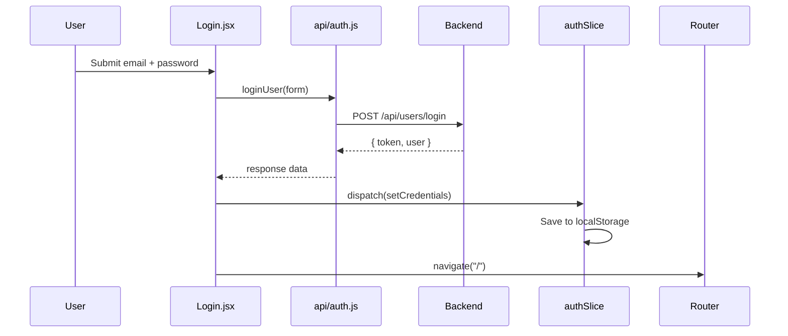

# Chapter 9 — React Frontend Setup

## Introduction

In Sprint 1, we built the React **owner dashboard** — the web app business owners use to manage their shop.

The frontend is what owners see in the browser. It talks to the Express backend using HTTP requests (via axios). This chapter covers the **foundation**: tooling, folder structure, routing, auth state, and the polished login/register experience.

For business setup, products, and orders, see **Chapter 10 — Owner Dashboard**.

---

## What we installed

| Package | Purpose |
|---------|---------|
| `vite` | Fast dev server and build tool |
| `react` | UI library |
| `react-router-dom` | Pages and URLs (`/login`, `/products`) |
| `@reduxjs/toolkit` | Global state (auth token, user) |
| `axios` | HTTP client to call backend APIs |
| `react-i18next` + `i18next` | English, Telugu, Hindi translations |
| `tailwindcss` | Utility CSS for styling |

**Why Vite instead of Create React App?** Vite starts almost instantly and uses native ES modules in dev. CRA is slower and less common in new projects today.

**Why Redux for auth only?** We only need global state for login (token + user). Every protected page reads the same auth slice. Local `useState` is fine for form fields on individual pages.

---

## Folder structure

```text
frontend/src/
├── api/              # Backend calls (auth, business, products, orders)
├── components/       # Reusable UI (Navbar, Layout, AuthLayout, PageShell)
├── constants/        # Shared values (business categories)
├── pages/            # Full screens (Login, Dashboard, Products)
├── store/            # Redux auth state
├── utils/            # Helpers (CSV parser)
├── i18n/             # Translation files
├── App.jsx           # Route definitions
└── main.jsx          # App entry point
```

**Why separate `api/` from `pages/`?** Pages focus on UI and user interaction. API modules focus on HTTP. If the backend URL or payload shape changes, you fix one file instead of every page.

---

## How the app starts

1. Browser loads `index.html`
2. `main.jsx` runs
3. Redux `Provider` wraps the app (global state)
4. `i18n` initializes (language from `localStorage` or default)
5. `App.jsx` sets up routes
6. User visits a URL → React shows the matching page

---

## Routing — two layouts

`App.jsx` uses **nested routes** with two different layouts:

```text
/login, /register, /forgot-password  →  AuthLayout  (public, no navbar)
/, /business, /products, /orders     →  ProtectedRoute → Layout → page
```

**Why two layouts?**

- **AuthLayout** — marketing-style split screen for login/register. No sidebar or dashboard chrome. Users should not feel “inside the app” until they authenticate.
- **Layout** — navbar + main content area for logged-in owners.

**Why ProtectedRoute wraps Layout?** One guard checks auth once. All child routes (`/`, `/products`, etc.) automatically require login. Unauthenticated users redirect to `/login`.

---

## Key files explained

### `src/api/axios.js`

Creates one axios instance with:

- `baseURL` from `VITE_API_URL` (points to backend)
- Request interceptor that adds `Authorization: Bearer <token>` on every request after login

**Why one instance?** Every API module imports the same `api`. Token attachment is centralized — pages never manually set headers.

### `src/api/auth.js`

Thin wrappers:

- `registerUser(data)` → `POST /api/users/register`
- `loginUser(data)` → `POST /api/users/login`
- `getProfile()` → `GET /api/users/profile`

### `src/store/authSlice.js`

Redux slice for authentication:

- `token` — JWT from backend
- `user` — logged-in user object
- `isAuthenticated` — derived from token presence
- `setCredentials` — save token + user after login/register
- `logout` — clear token

Token is also saved in `localStorage` so refresh keeps the user logged in.

**Why localStorage + Redux?** Redux holds live state for React. `localStorage` survives page refresh. On app load, the slice reads from `localStorage` to restore the session.

### `src/components/ProtectedRoute.jsx`

If `isAuthenticated` is false → redirect to `/login`.

Used for Dashboard, Products, Orders, Business pages.

### `src/components/AuthLayout.jsx`

Split-screen layout for auth pages:

- **Left (desktop):** BizBuilder branding, tagline, feature cards
- **Right:** Glassmorphism card with `<Outlet />` (Login, Register, or ForgotPassword)
- Gradient blur orbs in the background (Tailwind `blur-3xl`)
- `LanguageSwitcher` with `variant="auth"`

**Why glassmorphism?** Consistent visual language with the dashboard (dark slate + emerald accents) without copying the exact same navbar layout.

### `src/components/PasswordInput.jsx`

Password field with show/hide toggle (eye icon). Used on Login and Register.

**Why a component?** Same behavior and styling in two places. Accessibility: `aria-label` on the toggle button.

### `src/components/Layout.jsx`

Logged-in shell: gradient background, `Navbar`, centered `max-w-6xl` main area, `<Outlet />` for page content.

### `src/components/PageShell.jsx`

Reusable page header for dashboard sections (Business, Products, Orders):

- Badge (section name)
- Title + subtitle
- Content card below

**Why PageShell?** Every management page shares the same header rhythm. Dashboard uses custom layout; CRUD pages use PageShell.

### `src/i18n/`

- `en.json`, `te.json`, `hi.json` — same keys, different languages
- UI uses `t("login")` instead of hardcoded English
- Language choice saved in `localStorage`

---

## UI polish (Sprint 1)

We applied a consistent **dark emerald** design system:

| Pattern | Tailwind examples |
|---------|-------------------|
| Background | `bg-slate-950` + blurred gradient orbs |
| Cards | `rounded-3xl border border-white/15 bg-white/10 backdrop-blur-xl` |
| Primary button | `bg-gradient-to-r from-emerald-500 to-teal-500` |
| Inputs | `border-white/20 bg-white/10 focus:ring-emerald-400/30` |
| Errors | `border-red-400/30 bg-red-500/10 text-red-100` |
| Success | `border-emerald-400/30 bg-emerald-500/10` |

**Why Tailwind utilities instead of a CSS file?** Faster iteration while learning. Classes stay next to the element. For BizBuilder’s size, this is simpler than maintaining separate stylesheets.

---

## Environment variable

`frontend/.env`:

```env
VITE_API_URL=http://localhost:5000/api
```

Only variables starting with `VITE_` are visible to React code.

---

## How to run

Terminal 1 (backend):

```bash
cd backend
npm start
```

Terminal 2 (frontend):

```bash
cd frontend
npm run dev
```

Open: `http://localhost:5173`

---

## Step 2 — Login & Register (completed)

### What we built

| File | Role |
|------|------|
| `Login.jsx` | Email + password form → backend → Redux → redirect to `/` |
| `Register.jsx` | Name + email + password, same flow |
| `ForgotPassword.jsx` | Placeholder UI (“coming soon”) — backend not ready |
| `PasswordInput.jsx` | Shared password field with visibility toggle |
| `AuthLayout.jsx` | Branded wrapper for all auth routes |

### Login flow



1. User submits form
2. `loginUser(form)` → `POST /api/users/login`
3. Backend returns `{ token, user }`
4. `dispatch(setCredentials(...))` saves to Redux + `localStorage`
5. `navigate("/")` goes to dashboard

Register is identical except it calls `POST /api/users/register` with `name` included.

### Error handling

```javascript
catch (err) {
    setError(err.response?.data?.message || t("loginFailed"));
}
```

**Why read `err.response?.data?.message`?** Our backend sends human-readable errors in JSON. The `?.` avoids crashes if the network fails entirely (no `response`).

### Forgot password (planned, not built yet)

Needs backend first:

- `POST /api/users/forgot-password` — send reset email
- `POST /api/users/reset-password` — set new password with token
- Email service (SendGrid, Resend, or Nodemailer)

UI link exists on login page → `/forgot-password` shows “coming soon” until backend is ready.

---

## How to test auth

1. Start backend and frontend
2. Open `http://localhost:5173` — should redirect to `/login` (not authenticated)
3. Register a new account — should land on dashboard with your name
4. Refresh the page — should stay logged in (localStorage)
5. Logout from navbar — should return to `/login`
6. Try wrong password — should show error message, not crash
7. Switch language on login page — labels should change (EN / TE / HI)

---

## Practice questions

1. Why do we use a single axios instance instead of calling `axios.post` directly in each page?
2. What happens if you delete `localStorage` token and refresh the page?
3. Why is `ForgotPassword` inside `AuthLayout` but not inside `ProtectedRoute`?
4. Where would you add a “Remember me” checkbox if you wanted longer sessions?

---

## Next step

**Chapter 10 — Owner Dashboard:** Business setup, products CRUD, CSV import, and order management.

**Sprint 2:** Customer storefront (public product pages) and WhatsApp order notifications.
