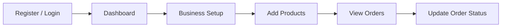
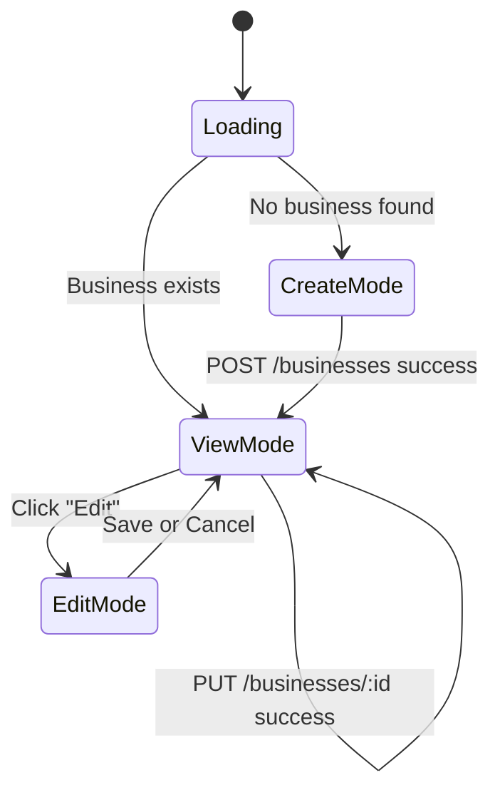
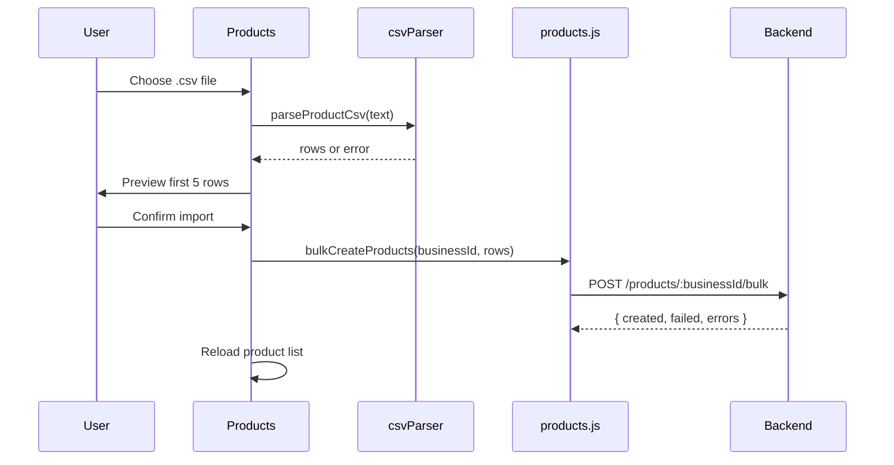
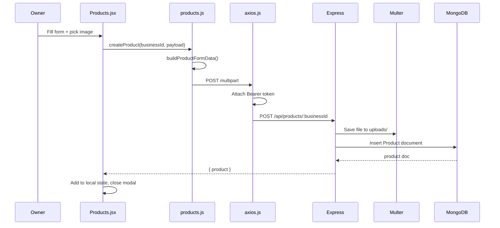
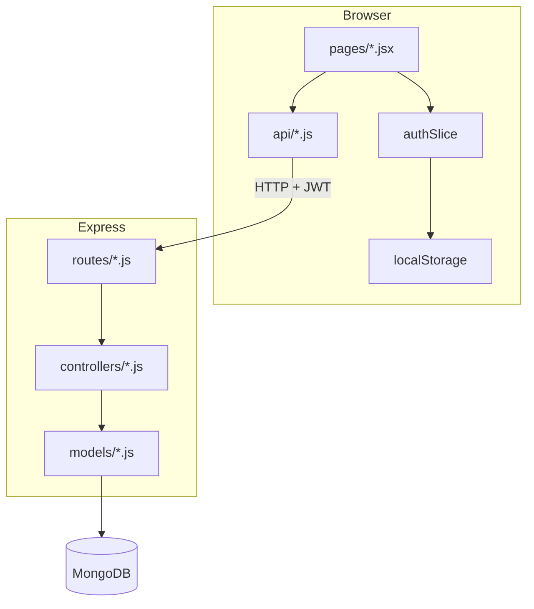

# Chapter 10 — Owner Dashboard (Sprint 1 Complete)

## Introduction

Sprint 1 delivers the **owner dashboard** — everything a business owner needs to run their shop from the browser **before** customers can order online.

By the end of Sprint 1, an owner can:

1. Register and log in
2. Create and edit their business profile
3. Add, edit, delete, and bulk-import products (with images)
4. View orders, update status, and delete eligible orders

This chapter explains **what** each module does, **why** we built it that way, and **how** to test it.

**Prerequisites:** Chapter 9 (React setup, auth flow).

---

## Sprint 1 overview — end-to-end owner journey



| Step | Page | API | Why it matters |
|------|------|-----|----------------|
| 1 | `/register` | `POST /users/register` | Owner account = JWT for all later calls |
| 2 | `/` | `GET /businesses/my-businesses` | Hub with quick links |
| 3 | `/business` | `POST/PUT /businesses` | Shop identity before products |
| 4 | `/products` | `POST/GET/PUT/DELETE /products` | Catalog owners manage |
| 5 | `/orders` | `GET/PUT/DELETE /orders` | Orders placed (via API or seed data today) |

**Why business before products?** Every product belongs to a `businessId`. The Products page loads the owner’s business first; if none exists, it prompts setup.

---

## Route map and key files

```text
App.jsx
├── AuthLayout          → Login, Register, ForgotPassword
└── ProtectedRoute
    └── Layout          → Navbar + main
        ├── Dashboard.jsx
        ├── BusinessSetup.jsx
        ├── Products.jsx
        └── Orders.jsx

api/
├── auth.js             → register, login, profile
├── business.js         → create, getMy, update
├── products.js         → CRUD + bulk + FormData images
└── orders.js           → list, update status, delete

components/
├── PageShell.jsx       → Section header + content card
├── AuthLayout.jsx      → Auth pages wrapper (Chapter 9)
├── Layout.jsx          → Logged-in shell
└── Navbar.jsx          → Nav links + logout + language

constants/
└── businessCategories.js

utils/
└── csvParser.js        → Parse product CSV for bulk import
```

---

## Dashboard (`/`)

**File:** `frontend/src/pages/Dashboard.jsx`

The dashboard is a **navigation hub**, not a data-heavy analytics screen yet.

### What it shows

- Greeting with user name from Redux (`user.name`)
- Business name (fetched from `getMyBusinesses()`)
- Placeholder stat cards (today’s orders, product count, pending — values are `0` until Sprint 2+ wiring)
- Quick-action cards linking to Business, Products, Orders

### Why placeholder stats?

Real stats need aggregation queries (orders today, pending count). Sprint 1 focused on CRUD flows. The UI slots are ready so we can plug in API data later without redesigning the page.

### Data flow

```text
Dashboard mount
  → getMyBusinesses()
  → GET /api/businesses/my-businesses
  → setBusinessName(first business)
```

Errors are swallowed silently — the dashboard still works if the business fetch fails (new user with no business yet).

### How to test

1. Log in → see “Hello, {name}”
2. Before business setup → “Setup business” CTA
3. After business setup → business name label + “Edit business” CTA
4. Click each quick-action card → correct page loads

---

## Business setup (`/business`)

**Files:**

- `frontend/src/pages/BusinessSetup.jsx`
- `frontend/src/api/business.js`
- `frontend/src/constants/businessCategories.js`

### What owners can do

- **Create** a business (first time)
- **View** saved profile in read-only mode
- **Edit** and save changes

### Form fields

| Field | Required | Notes |
|-------|----------|-------|
| `businessName` | Yes | Display name |
| `category` | Yes | Dropdown from `BUSINESS_CATEGORIES` |
| `phoneNumber` | Yes | Contact for orders |
| `address` | Yes | Delivery / pickup context |
| `email` | No | Optional contact |
| `website` | No | Optional URL |
| `logo` | No | Logo URL (not file upload yet) |
| `description` | No | About the shop |

### Categories — why a constants file?

`businessCategories.js` holds `{ value, labelKey }` pairs. Values are stored in MongoDB (`cloud_kitchen`, `bakery_sweets`, …). Labels come from i18n (`t("categoryBakerySweets")`) so Telugu and Hindi owners see translated category names.

**Why not fetch categories from the API?** The list is fixed product vocabulary. A constants file is simpler and works offline in the UI. If we add admin-managed categories later, we can move to an API.

### Edit vs create flow



- `isEditing` toggles inputs vs read-only display
- `businessId` set after first create — subsequent saves use `updateBusiness`

### API calls

```javascript
createBusiness(payload)   // POST /api/businesses
getMyBusinesses()           // GET /api/businesses/my-businesses
updateBusiness(id, payload) // PUT /api/businesses/:id
```

### Validation errors

Backend returns `errors: [{ msg }]`. The page joins them into one error string for the user.

### How to test

1. New user → all fields editable → “Create business”
2. Success → form switches to read-only, green success banner
3. “Edit business” → fields editable again
4. Change phone number → save → read-only shows new value
5. Try empty required field → browser + backend validation
6. Switch language → category dropdown labels change

---

## Products (`/products`)

**Files:**

- `frontend/src/pages/Products.jsx`
- `frontend/src/api/products.js`
- `frontend/src/utils/csvParser.js`

### What owners can do

| Feature | Description |
|---------|-------------|
| List | Grid of product cards with image, price (₹), stock |
| Search | Client-side filter by name or description |
| Pagination | 12 products per page |
| Create | Modal form + **required** image file |
| Edit | Modal pre-filled; image optional on update |
| Delete | Confirmation dialog |
| CSV bulk import | Upload file → preview 5 rows → import |

### Why image upload uses FormData

Product images are files, not JSON. `products.js` builds `FormData`:

```javascript
formData.append("productName", data.productName);
formData.append("price", String(data.price));
formData.append("image", data.image);  // File object
```

Backend uses **multer** (`upload.single("image")`) to save to `uploads/products/` and store the path on the product document.

**Why required on create but optional on edit?** New products need a visual for the catalog. On edit, owner may only change price/stock — sending a new file is optional.

### Search and pagination — why client-side?

Sprint 1 loads all products for one business (`GET /products/business/:businessId`). For small shops (&lt; 100 products), filtering in the browser is instant and avoids extra API parameters.

When catalogs grow (Sprint 2+), we can add server-side `?search=&page=` query params.

```javascript
const filteredProducts = useMemo(() => {
    const query = searchQuery.trim().toLowerCase();
    return products.filter(p =>
        p.productName?.toLowerCase().includes(query) ||
        p.description?.toLowerCase().includes(query)
    );
}, [products, searchQuery]);
```

Pagination slices `filteredProducts` — changing search resets to page 1.

### CSV bulk import

**Why CSV?** Home-business owners often keep inventory in Excel/Google Sheets. Export as CSV → import in one click instead of typing 50 products.

#### Template

```csv
productName,description,price,stock,imageUrl
Chicken Biryani,Spicy homemade biryani,299,50,https://example.com/img.jpg
Masala Chai,Fresh brewed tea,49,100,
```

- Header row required: `productName`, `description`, `price`, `stock`, `imageUrl`
- `imageUrl` optional — backend uses placeholder when omitted

#### Parser (`csvParser.js`)

- Handles quoted commas (`"Spicy, hot"`)
- Normalizes headers to lowercase
- Returns `{ rows }` or `{ error: "invalidHeader" | "noRows" }`

#### Import flow



Response shape: `{ created, failed, errors: [{ row, message }] }`

### API summary

| Action | Method | Endpoint |
|--------|--------|----------|
| List | GET | `/products/business/:businessId` |
| Create | POST | `/products/:businessId` (multipart) |
| Update | PUT | `/products/:productId` (multipart if new image) |
| Delete | DELETE | `/products/:productId` |
| Bulk | POST | `/products/:businessId/bulk` JSON body |

### No business state

If `getMyBusinesses()` returns empty, Products shows a link to `/business` instead of an empty grid.

### How to test

1. Without business → “Setup business first” message
2. Add product with image → appears in grid
3. Edit price → card updates
4. Delete → confirmation → removed from list
5. Search “biryani” → only matching cards
6. Add 15+ products → pagination appears
7. Import valid CSV → success summary with created count
8. Import bad header → error in modal
9. Create without image → form error “image required”

---

## Orders (`/orders`)

**Files:**

- `frontend/src/pages/Orders.jsx`
- `frontend/src/api/orders.js`

### What owners can do

| Feature | Description |
|---------|-------------|
| List | Order cards with customer info, total, status badge |
| Search | By customer name, phone, status (EN + translated label) |
| Pagination | 12 orders per page |
| Expand | Show line items (product name, qty, price) |
| Update status | Dropdown + Save (non-terminal orders only) |
| Delete | Only `Pending` or `Cancelled` orders |

### Order statuses

```text
Pending → Confirmed → Preparing → Completed → Delivered
              ↘ Cancelled
```

| Status group | UI behavior |
|--------------|-------------|
| **Terminal** (`Delivered`, `Cancelled`, `Completed`) | Status dropdown hidden — no further changes |
| **Deletable** (`Pending`, `Cancelled`) | Delete button shown |
| **Active** (others) | Status dropdown + Save |

**Why restrict delete?** Completed/delivered orders are financial records. Pending/cancelled are safe to remove (mistakes, test orders).

### Status update flow

1. Owner changes dropdown → `statusDrafts[orderId]` updates (local only)
2. Click Save → `PUT /orders/:id` with `{ orderStatus }`
3. On success → order in list replaced with server response
4. On failure → draft reverts to original status

**Why draft + Save instead of auto-save on change?** Prevents accidental status changes. Owner explicitly confirms.

### API summary

| Action | Method | Endpoint |
|--------|--------|----------|
| List mine | GET | `/api/orders` |
| Update status | PUT | `/api/orders/:orderId` |
| Delete | DELETE | `/api/orders/:orderId` |

### How orders appear today

In Sprint 1, orders typically come from:

- Backend seed/script data
- Direct API calls (Swagger / Postman)
- Future: customer storefront (Sprint 2)

The owner UI is ready — it lists whatever the backend returns for the authenticated owner’s business.

### How to test

1. Seed or create test orders via API
2. Orders page → cards with customer name, amount, status badge
3. Search by phone fragment → filters list
4. Expand order → line items visible
5. Change Pending → Confirmed → Save → badge updates
6. Delivered order → no status dropdown
7. Delete Pending order → confirmation → removed
8. Try delete on Completed → button not shown

---

## Shared patterns across pages

### PageShell

Business, Products, and Orders wrap content in `PageShell` for consistent headers. Dashboard uses its own hero layout.

### Loading and error states

Each page follows the same pattern:

```text
loading=true  → "Loading..."
try API call
catch         → red error banner (translated message)
finally       → loading=false
```

### Success banners

Green banner after create/update/delete. Cleared on next action.

### `getMyBusinesses()` on every module

Products and Orders fetch the owner’s first business on mount. **Why repeat?** Each page is self-contained — deep-linking to `/products` works without visiting dashboard first.

Trade-off: extra API call per page. Acceptable for Sprint 1; can cache business in Redux later.

---

## Full data flow — create product example



---

## Architecture diagram — Sprint 1 frontend



---

## How to test each module (checklist)

### Auth (Chapter 9)

- [ ] Register new user
- [ ] Login / logout
- [ ] Refresh persists session
- [ ] Wrong password shows error

### Dashboard

- [ ] Greeting shows name
- [ ] Business name after setup
- [ ] Quick links work

### Business

- [ ] Create business
- [ ] View read-only profile
- [ ] Edit and save
- [ ] Categories translate with language switch

### Products

- [ ] CRUD with image
- [ ] Search and pagination
- [ ] CSV import success and failure cases
- [ ] Blocked without business

### Orders

- [ ] List with seeded orders
- [ ] Status update
- [ ] Delete Pending only
- [ ] Search and pagination

### i18n

- [ ] Switch EN / TE / HI on navbar and auth pages
- [ ] Order status labels translate

---

## Practice questions

1. Why does `createProduct` use `FormData` but `bulkCreateProducts` sends JSON?
2. What would break if you removed `ProtectedRoute` from `App.jsx`?
3. Why do we store `statusDrafts` separately instead of editing `orders` directly on dropdown change?
4. How would you show real product count on the Dashboard stat card?
5. Why is CSV parsing done in the frontend instead of sending the raw file to the backend?

---

## What's next — Sprint 2

| Feature | Chapter (planned) | Description |
|---------|-------------------|-------------|
| Customer storefront | `12_Customer_Storefront.md` | Public `/shop/:businessId` — browse products, place orders |
| WhatsApp notifications | `13_WhatsApp_Integration.md` | Owner gets WhatsApp message when new order arrives |
| Live dashboard stats | Chapter 10 update | Wire stat cards to real counts |
| Forgot password | Chapter 9 update | Email reset flow |
| Server-side search | Chapter 10 update | Pagination API for large catalogs |

Sprint 1 built the **owner side**. Sprint 2 connects **customers** to the same backend so orders flow naturally into the Orders page you already have.

---

## Quick reference — API endpoints used by dashboard

| Module | Endpoints |
|--------|-----------|
| Auth | `POST /users/register`, `POST /users/login` |
| Business | `GET /businesses/my-businesses`, `POST /businesses`, `PUT /businesses/:id` |
| Products | `GET /products/business/:id`, `POST /products/:businessId`, `PUT /products/:id`, `DELETE /products/:id`, `POST /products/:businessId/bulk` |
| Orders | `GET /orders`, `PUT /orders/:id`, `DELETE /orders/:id` |

All require `Authorization: Bearer <token>` except register and login.
