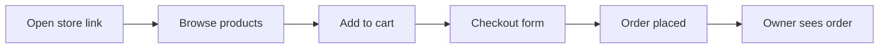

# Chapter 12 — Customer Storefront (Sprint 2A)

## Introduction

Sprint 2A delivers the **customer storefront** — a public shop page where customers browse products and place orders **without logging in**.

By the end of Sprint 2A:

1. Customers open `/store/:businessId` and see the business profile and in-stock products
2. Customers add items to a cart, fill checkout details, and place an order
3. Owners copy their store link from the dashboard and share it (WhatsApp, social, etc.)
4. Orders appear in the owner’s Orders page with customer contact details stored

**Prerequisites:** Chapter 10 (owner dashboard, products, orders).

---

## Sprint 2A overview — customer journey



| Step | Page / API | Auth |
|------|------------|------|
| 1 | `/store/:businessId` | None |
| 2 | `GET /api/public/businesses/:id` | None |
| 3 | `GET /api/public/businesses/:businessId/products` | None |
| 4 | `POST /api/public/businesses/:businessId/orders` | None |
| 5 | Owner `/orders` | JWT |

---

## Backend — public API design

### Why `/api/public`?

Owner routes require JWT. Customer storefront routes are **public** — no token. Grouping them under `/api/public` keeps security boundaries clear.

### Public business profile

`GET /api/public/businesses/:id` returns only safe fields:

- `businessName`, `category`, `phoneNumber`, `address`

No `owner`, `email`, or internal IDs beyond the business `_id` used in the URL.

### Public products

`GET /api/public/businesses/:businessId/products` returns products where `stock > 0`. Out-of-stock items are hidden from customers.

### Public order creation

`POST /api/public/businesses/:businessId/orders` accepts:

- `customerName`, `customerPhone`, `customerAddress` (required)
- `products` array (`product` ID + `quantity`)
- `paymentMethod` (`Cash`, `Card`, `UPI`)

Public checkout does **not** collect customer WhatsApp numbers. Order model fields `isWhatsAppSameAsPhone` and `customerWhatsApp` remain for backward compatibility; public orders default `isWhatsAppSameAsPhone` to `true` and copy `customerPhone` into `customerWhatsApp`. **Owner WhatsApp notifications** (Sprint 2B) use the business `phoneNumber` from setup.

### Shared order logic

`backend/utils/processOrderCreation.js` centralizes:

1. Aggregate duplicate product lines
2. Validate products belong to the business and stock is sufficient
3. Decrement stock (with restore on failure)
4. Create the Order document

Both owner `POST /api/orders` and public order endpoint use this helper.

### Order model updates

New fields for Sprint 2A (WhatsApp prep for Sprint 2B):

```javascript
isWhatsAppSameAsPhone: { type: Boolean, default: true }
customerWhatsApp: { type: String, trim: true }
```

Public storefront checkout does not ask for a separate WhatsApp number. On order creation, `isWhatsAppSameAsPhone` is set to `true` and `customerWhatsApp` is copied from `customerPhone`. Owner order alerts in Sprint 2B use `business.phoneNumber`.

---

## Key backend files

| File | Purpose |
|------|---------|
| `routes/publicRoutes.js` | Registers public routes |
| `controllers/publicController.js` | Business, products, order handlers |
| `validators/publicValidator.js` | Checkout validation |
| `utils/processOrderCreation.js` | Shared stock + order creation |
| `docs/public/public.swagger.js` | Swagger paths |
| `docs/components/publicSchemas.swagger.js` | Public schemas |

`server.js` mounts: `app.use("/api/public", publicRoutes)`.

---

## Frontend — storefront page

### Route

`/store/:businessId` — registered in `App.jsx` **outside** `ProtectedRoute`.

### `pages/Storefront.jsx`

- **StoreShell** — dark glass layout (matches AuthLayout aesthetic)
- **Business header** — name, category (i18n label), address, phone
- **Product grid** — mobile-first cards with image, price, stock, add/remove
- **Cart drawer** — slide-over panel with quantity controls
- **Checkout modal** — name, phone, address, payment method
- **Success state** — confirmation with order reference

### API layer

`frontend/src/api/public.js`:

```javascript
getPublicBusiness(businessId)
getPublicProducts(businessId)
createPublicOrder(businessId, payload)
```

Uses the same axios instance; no JWT is required (interceptor only adds token if logged in).

### Copy store link (owner dashboard)

`Dashboard.jsx` loads `businessId` and copies:

`{origin}/store/{businessId}`

to the clipboard via `navigator.clipboard.writeText`.

---

## i18n

Storefront strings added to `en.json`, `te.json`, `hi.json`:

- Cart, checkout, success messages
- `copyStoreLink`, `storeLinkCopied`

---

## How to test manually

1. Start backend (`npm run dev` in `backend/`) and frontend (`npm run dev` in `frontend/`).
2. Log in as owner → create business → add products with stock > 0.
3. Dashboard → **Copy store link** → open in new tab (or incognito).
4. Add products to cart → checkout → place order.
5. Log in as owner → **Orders** → confirm new order appears.
6. Swagger: `http://localhost:5000/api-docs` → **Public** tag.

Example API calls:

```bash
curl http://localhost:5000/api/public/businesses/YOUR_BUSINESS_ID
curl http://localhost:5000/api/public/businesses/YOUR_BUSINESS_ID/products
```

---

## Deferred to later sprints

- Customer order tracking page
- Product search on storefront
- Store branding (logo on header)
- Rate limiting specific to public order endpoint
- WhatsApp templates in Telugu/Hindi (Sprint 2B uses English text for MVP)

---

## Summary

Sprint 2A connects the owner’s catalog to a **shareable public URL**. Customers order without accounts; owners manage orders in the existing dashboard. Shared `processOrderCreation` keeps stock rules consistent between owner and public flows.
