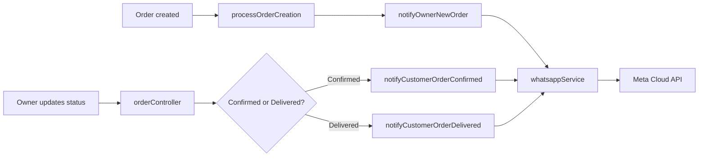

# Chapter 13 — WhatsApp Notifications (Sprint 2B)

## Introduction

Sprint 2B adds **WhatsApp alerts** so owners and customers get timely updates without refreshing the dashboard.

| Event | Recipient | Phone source |
|-------|-----------|--------------|
| New order placed | Business owner | `business.phoneNumber` |
| Order status → Confirmed | Customer | `customerWhatsApp` or `customerPhone` |
| Order status → Delivered | Customer | `customerWhatsApp` or `customerPhone` |

**Prerequisites:** Chapter 12 (customer storefront, order creation flow).

---

## Provider choice — Meta WhatsApp Cloud API

We use **Meta WhatsApp Cloud API** because:

- It is listed in `PRODUCT_VISION.md` as a primary option
- No extra npm dependency — Node’s built-in `fetch` is enough
- Clear env vars: access token + phone number ID
- Free test sandbox for development

**Production note:** WhatsApp requires **pre-approved message templates** for business-initiated messages outside the 24-hour customer window. Sprint 2B uses simple text messages for local dev; before launch, create and approve templates in Meta Business Manager.

---

## Architecture



### Fire-and-forget

WhatsApp failures **must not** roll back orders. The service:

1. Catches errors internally and logs with `console.error`
2. Skips silently when API credentials are missing (logs the message instead)
3. Never throws back to the order controller

---

## Key file — `backend/services/whatsappService.js`

| Export | Purpose |
|--------|---------|
| `normalizePhoneNumber(phone)` | Indian numbers → `91XXXXXXXXXX` digits |
| `isConfigured()` | True when token + phone number ID are set |
| `sendWhatsAppMessage(to, body)` | Low-level Meta API call |
| `notifyOwnerNewOrder(order, businessId)` | Owner alert after new order |
| `notifyCustomerOrderConfirmed(order, business)` | Customer alert on confirm |
| `notifyCustomerOrderDelivered(order, business)` | Customer alert on delivery |

### Phone normalization

Indian mobiles are normalized before sending:

- `9876543210` → `919876543210`
- `+91 98765 43210` → `919876543210`
- Invalid numbers are skipped with a warning log

---

## Integration points

### 1. New order — `utils/processOrderCreation.js`

After `Order.create()`, call:

```javascript
notifyOwnerNewOrder(order, businessId);
```

Both **public storefront** and **owner-created** orders use this helper, so owner alerts work for every order path.

### 2. Status updates — `controllers/orderController.js`

After `order.save()` in `updateOrderStatus`:

- `Confirmed` → `notifyCustomerOrderConfirmed(order, business)`
- `Delivered` → `notifyCustomerOrderDelivered(order, business)`

`business` is already loaded for authorization checks.

---

## Environment variables

Add to `backend/.env` (see `.env.example`):

```env
WHATSAPP_API_TOKEN=your_meta_access_token
WHATSAPP_PHONE_NUMBER_ID=your_phone_number_id
# Optional:
# WHATSAPP_API_URL=https://graph.facebook.com/v21.0
```

If either required var is missing, messages are **logged to the console** and skipped — orders still succeed.

---

## How to get Meta WhatsApp API credentials

1. Go to [developers.facebook.com](https://developers.facebook.com/) → create an app → add **WhatsApp** product.
2. In WhatsApp → **API Setup**, copy:
   - **Temporary access token** (or create a system user token for production)
   - **Phone number ID** (test number works for dev)
3. Add your personal WhatsApp number as a **test recipient** in the Meta dashboard.
4. Paste token and phone number ID into `backend/.env`.
5. Restart the backend.

For production: verify your business, add a real WhatsApp Business number, and submit message templates for approval.

---

## How to test locally

### Without API keys (default)

1. Start backend and frontend.
2. Place an order (storefront or owner dashboard).
3. Check backend terminal — you should see:
   `[WhatsApp] Skipped (no API credentials) -> 919876543210: New order #ABC123 ...`
4. Update order to Confirmed/Delivered — same skip log for customer messages.
5. Orders must still save and appear in the dashboard.

### With API keys

1. Set `WHATSAPP_API_TOKEN` and `WHATSAPP_PHONE_NUMBER_ID` in `.env`.
2. Register test phone numbers in Meta dashboard.
3. Place an order → owner phone receives WhatsApp.
4. Confirm order → customer phone receives WhatsApp.
5. Mark delivered → customer receives thank-you message.

---

## Frontend (minimal)

- **Business setup** already shows `phoneNumberHint`: “Used for WhatsApp order alerts”.
- **Orders page** shows a small note that WhatsApp alerts are sent on new orders and status changes.

No heavy notification settings UI in Sprint 2B.

---

## Message templates (examples)

**Owner — new order:**

> New order #ABC123 from Raj - ₹500. Customer: 9876543210. Check BizBuilder dashboard.

**Customer — confirmed:**

> Your order #ABC123 from Sravani's Kitchen is confirmed! We will prepare it soon.

**Customer — delivered:**

> Your order #ABC123 from Sravani's Kitchen has been delivered. Thank you!

---

## Future improvements (not in Sprint 2B)

- Redis job queue so API requests don’t run inline
- Approved WhatsApp templates per language (Telugu, Hindi)
- Notifications for Preparing, Cancelled
- Owner toggle to enable/disable alerts

---

## Production deployment (Sprint 2C)

For local dev, use temporary Meta tokens and test recipient numbers. **Production** requires additional steps on Railway:

1. **Permanent token** — create a System User in Meta Business Manager (temporary tokens expire in ~24 hours)
2. **Verified business** — complete Meta Business Verification for messaging customers at scale
3. **Production phone number** — add and verify your WhatsApp Business number; copy Phone number ID to `WHATSAPP_PHONE_NUMBER_ID` on Railway
4. **Message templates** — submit templates for owner new-order, customer confirmed, and customer delivered messages; Meta must approve before outbound messages to unknown numbers
5. **Railway env vars** — set `WHATSAPP_API_TOKEN` and `WHATSAPP_PHONE_NUMBER_ID` alongside other backend vars

Full click-by-click guide: **`DEPLOYMENT.md`** → WhatsApp production setup section.

| Environment | Token | Recipients | Messages |
|-------------|-------|------------|----------|
| Local dev | Temporary from Meta dashboard | Test numbers only | Free-form text |
| Production | Permanent system user token | Any customer (after verification) | Templates recommended |

---

## Summary

Sprint 2B wires WhatsApp into the existing order flow with a small service layer. Orders always succeed; WhatsApp is best-effort. Meta Cloud API keeps dependencies minimal and matches the product vision for Indian home businesses.
