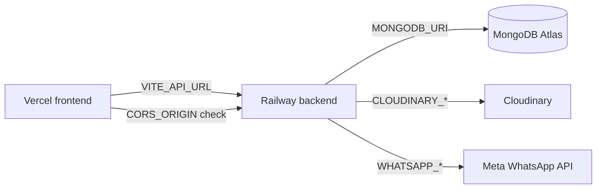

# Chapter 14 — Deploy MVP (Sprint 2C)

## Introduction

Sprint 2C puts BizBuilder on the internet so real business owners and customers can use it without `localhost`. We deploy:

| Layer | Platform | Why |
|-------|----------|-----|
| Frontend (React) | **Vercel** | Free tier, HTTPS, great Vite support |
| Backend (Express) | **Railway** | Simple Node deploy, env vars, health checks |
| Database | **MongoDB Atlas** | Already used in development |
| Images | **Cloudinary** | Already used in development |
| WhatsApp | **Meta Cloud API** | Credentials on Railway (Chapter 13) |

**Full step-by-step checklist:** see `DEPLOYMENT.md` in the repo root.

---

## What we added in code

### Health check — `GET /api/health`

Railway needs a URL to verify the server is alive:

```javascript
app.get("/api/health", (req, res) => {
    res.status(200).json({ success: true, message: "OK" });
});
```

Returns `200` with JSON — no database call (fast, works even if DB is slow to connect on cold start).

### CORS for production — `server.js`

```javascript
const corsOrigin = process.env.CORS_ORIGIN || "http://localhost:5173";

app.use(
    cors({
        origin: corsOrigin.split(",").map((origin) => origin.trim()),
        credentials: true
    })
);
```

In production, set `CORS_ORIGIN` to your Vercel URL. Comma-separate multiple origins for preview deploys.

### Frontend API URL — `VITE_API_URL`

Both `src/api/axios.js` and `src/api/publicAxios.js` use:

```javascript
baseURL: import.meta.env.VITE_API_URL || "http://localhost:5000/api"
```

Vite only exposes vars prefixed with `VITE_`. Set this on Vercel to your Railway API URL + `/api`.

### Swagger production URL — `API_URL`

`backend/config/swagger.js` uses `process.env.API_URL` for the server list in `/api-docs`.

### Railway config — `backend/railway.toml`

```toml
[deploy]
startCommand = "npm start"
healthcheckPath = "/api/health"
```

### Vercel SPA rewrites — `frontend/vercel.json`

React Router handles routes client-side. Without rewrites, refreshing `/login` would 404 on Vercel:

```json
{
    "rewrites": [{ "source": "/(.*)", "destination": "/index.html" }]
}
```

### Legal placeholder pages

`/privacy` and `/terms` — simple static pages required before marketing. Replace with lawyer-reviewed text later.

---

## Environment variables flow



| Where | Key vars |
|-------|----------|
| Railway | `MONGODB_URI`, `JWT_SECRET`, `CORS_ORIGIN`, `API_URL`, `CLOUDINARY_*`, `WHATSAPP_*`, `NODE_ENV=production` |
| Vercel | `VITE_API_URL` |

See `backend/.env.example` and `frontend/.env.example`.

---

## Deployment order (why it matters)

1. **Railway first** — you need the backend URL before setting `VITE_API_URL`
2. **Vercel second** — frontend points at Railway
3. **Update CORS** — backend must allow the Vercel origin
4. **WhatsApp last** — optional; app works without it

---

## HTTPS

Vercel and Railway provide SSL certificates automatically. No Let's Encrypt or nginx setup for MVP.

---

## WhatsApp in production

Chapter 13 covers local dev. For production:

1. Meta Business verification + real WhatsApp Business number
2. Permanent system user token (not temporary dev token)
3. Set `WHATSAPP_API_TOKEN` and `WHATSAPP_PHONE_NUMBER_ID` on Railway
4. Plan message template approval before messaging many unknown customers

Details: `DEPLOYMENT.md` → WhatsApp production setup section.

---

## How to test production

| Test | Pass criteria |
|------|---------------|
| `curl .../api/health` | `{"success":true,"message":"OK"}` |
| Login on Vercel URL | No CORS errors in console |
| Storefront order | Order in dashboard |
| WhatsApp (if configured) | Owner/customer phones receive messages |
| `/privacy`, `/terms` | Pages load |

---

## What we deliberately skipped (MVP)

- Custom domain
- CI/CD pipeline
- Redis queue for WhatsApp
- Staging environment
- IP-restricted Atlas (using `0.0.0.0/0` for simplicity)

Add these when you have real traffic or paying customers.

---

## Summary

Sprint 2C is mostly **configuration and hosting** — the app code was already env-driven. Railway runs the API, Vercel serves the React build, Atlas and Cloudinary stay the same, and WhatsApp credentials move from local `.env` to Railway variables. Follow `DEPLOYMENT.md` for the exact click-by-click steps.
