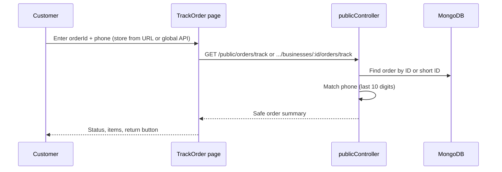

# Chapter 15 — Sprint 3: Revenue, Tracking, Returns & WhatsApp (Sprint 3)

## Introduction

Sprint 3 adds four owner and customer-facing capabilities:

| Feature | Who benefits | Key files |
|---------|--------------|-----------|
| Dashboard revenue/sales | Owner | `frontend/src/pages/Dashboard.jsx` |
| Order tracking | Customer | `TrackOrder.jsx`, `publicController.js` |
| Return orders | Customer + Owner | `Orders.js` model, `Orders.jsx`, public + owner APIs |
| Expanded WhatsApp | Customer + Owner | `whatsappService.js`, `orderController.js` |

**Prerequisites:** Chapters 10 (owner dashboard), 12 (storefront), 13 (WhatsApp basics).

---

## Feature 1 — Dashboard revenue/sales

The dashboard already loaded orders via `getMyOrders()`. Sprint 3 derives revenue from that same data — no new API.

### Calculations

- **Today's sales** — sum `totalAmount` for orders created today, excluding `Cancelled`
- **This month sales** — same filter for the current calendar month
- **Today's orders** and **Pending** — unchanged counts

Currency is formatted as `₹` with `toLocaleString("en-IN")`.

### UI

Stat cards updated to a 4-column grid:

`todayOrders` · `todayRevenue` · `monthRevenue` · `pending`

---

## Feature 2 — Customer order tracking

### Public API

```
GET /api/public/orders/track/:token
GET /api/public/orders/track?orderId=&phone=
GET /api/public/businesses/:idOrSlug/orders/track?orderId=&phone=
```

- **Secure token** — 64-char hex `trackingToken` generated on order create; unguessable (256 bits). Sent to customer via WhatsApp and copy link on success screen. No phone required when token is valid.
- `orderId` — full MongoDB ID or last 6 characters (case-insensitive) — fallback when customer has no link
- `phone` — must match `customerPhone` on the order (last 10 digits compared); required for manual tracking to prevent order-ID guessing
- `idOrSlug` — MongoDB ObjectId **or** business slug (e.g. `sravani-kitchen`)
- Global endpoint finds order without store ID (phone narrows short-ID matches)
- Returns safe fields only: status, items summary, totals, dates, business name — no owner secrets
- Owner APIs exclude `trackingToken` from list/detail responses

### Store slugs

- `Business` model has unique `slug` (auto-generated from `businessName`, duplicates get `-2`, `-3` suffix)
- `GET /api/public/businesses/:idOrSlug` and related routes resolve by id or slug
- Existing businesses without a slug get one on first public read (pre-save hook)
- Dashboard **Copy store link** uses slug when available

### Frontend

- **My Orders** — `localStorage` keys `bizbuilder_my_orders` and `bizbuilder_last_phone` (per businessId)
- Routes:
  - `/store/:storeSlug` — storefront (slug or legacy id)
  - `/store/:storeSlug/track/:token` — secure track link (no form)
  - `/track/:token` — global secure track link
  - `/store/:storeSlug/my-orders` — orders for one shop
  - `/my-orders` — all orders across shops on this device
  - `/store/:storeSlug/track` — track with order ID + phone (fallback)
  - `/track-order` — legacy global track page
- After checkout: WhatsApp track link (if configured) or **Copy track link** button; token saved in `localStorage`
- **My Orders** links use token URL when available; phone+orderId fallback for older saved orders

---

## Feature 3 — Return orders

### Model (`backend/models/Orders.js`)

| Field | Type | Notes |
|-------|------|-------|
| `returnStatus` | enum | `None`, `Requested`, `Approved`, `Rejected`, `Completed` — default `None` |
| `returnReason` | String | optional |
| `returnRequestedAt` | Date | set when customer requests |
| `returnResolvedAt` | Date | set when owner approves/rejects |

### Customer flow

```
POST /api/public/businesses/:businessId/orders/:orderId/return-request
Body: { phone, reason? }
```

- Only for `Delivered` or `Completed` orders
- 30-day return window from last update
- Phone must match order

### Owner flow

```
PUT /api/orders/:id/return
Body: { returnStatus: "Approved" | "Rejected" }
```

- Only when `returnStatus === "Requested"`
- **Approve** → `restoreStock()` (same as cancel), set `returnStatus` to `Completed`, WhatsApp to customer
- **Reject** → `returnStatus` to `Rejected`

---

## Feature 4 — Expanded WhatsApp notifications

| Event | Recipient | Function |
|-------|-----------|----------|
| Order placed (storefront) | Customer | `notifyCustomerOrderPlaced` (includes track link) |
| Order placed | Owner | `notifyOwnerNewOrder` (existing) |
| Status → Preparing | Customer | `notifyCustomerOrderPreparing` |
| Status → Confirmed | Customer | `notifyCustomerOrderConfirmed` (existing) |
| Status → Delivered | Customer | `notifyCustomerOrderDelivered` (existing) |
| Status → Cancelled | Customer | `notifyCustomerOrderCancelled` |
| Return approved | Customer | `notifyCustomerReturnApproved` |

All notifications remain **fire-and-forget** — failures are logged, never rolled back.

---

## Data flow — order tracking



---

## Key files

| File | Role |
|------|------|
| `backend/utils/orderTrackUrl.js` | Build frontend track URLs for WhatsApp |
| `backend/utils/phoneMatch.js` | Normalize and compare Indian phone numbers |
| `backend/controllers/publicController.js` | `trackPublicOrderGlobal`, `trackPublicOrder`, `requestPublicReturn` |
| `backend/controllers/orderController.js` | `updateReturnStatus`, WhatsApp on status change |
| `backend/services/whatsappService.js` | New customer notification helpers |
| `frontend/src/utils/customerOrdersStorage.js` | localStorage for customer orders |
| `frontend/src/pages/MyOrders.jsx` | Saved orders list + status refresh |
| `frontend/src/pages/TrackOrder.jsx` | Public tracking + return request UI |
| `frontend/src/pages/Dashboard.jsx` | Revenue stat cards |
| `frontend/src/pages/Orders.jsx` | Owner approve/reject return UI |

---

## How to test locally

1. Start backend and frontend as usual.
2. **Revenue:** Place a few orders today, open owner dashboard — check today's/month sales.
3. **Tracking:** Place order → open track link from success screen or WhatsApp; token page loads without phone. Fallback: order number + phone on `/store/:slug/track`.
4. **Returns:** Mark an order Delivered, request return from track page, approve from Orders page — verify stock restored.
5. **WhatsApp:** Check server logs for `[WhatsApp]` messages with track URL (or real sends if API credentials are set). Set `FRONTEND_URL=http://localhost:5173` in backend `.env`.

---

## Deferred / future improvements

- Dedicated `deliveredAt` field for more accurate return windows
- Email/SMS fallback when WhatsApp is not configured
- Owner-initiated return (currently customer requests, owner approves)
- Revenue API endpoint if order volume grows too large for client-side aggregation
